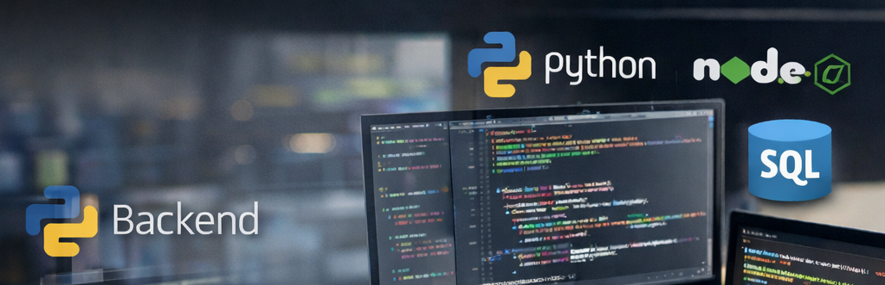

<!-- ===================== HERO / AI + BLOCKCHAIN AURA ===================== -->

  

  

  

---

## 🧠 About Me

I am a **Senior Backend & AI Integration Engineer** with deep experience in **Blockchain Infrastructure**, **Financial Systems**, and **Production AI**.

I build systems where:
- 💰 **real money moves**
- 🤖 **AI makes decisions or assists workflows**
- 🔗 **smart contracts enforce rules**
- 📊 **ledgers must always reconcile**
- 🛡 **failures are unacceptable**

My work focuses on **connecting AI models to real backend systems**, ensuring **correctness, security, cost control, and operational stability** in production environments.

---

## 🤖 AI & LLM Focus (Applied, Not Research)

- LLM integration (OpenAI, Azure AI, Claude-style models)
- AI-powered backend services & APIs
- RAG pipelines (documents, databases, embeddings)
- Tool / function calling with deterministic execution
- AI output validation, guardrails & fallback strategies
- Cost, latency, and reliability optimization for AI services

> *I treat AI as infrastructure — not a demo.*

---

## 🔗 Blockchain Focus (Infrastructure-Level)

- Blockchain protocol design & integration  
- Smart contract development & security review  
- On-chain / off-chain system boundaries  
- DeFi primitives (DEXs, tokens, intents, settlements)  
- Blockchain-backed financial ledgers  
- Security-first Web3 architecture  

---

## 🧩 Engineering Philosophy

> **“AI removes effort. Blockchain removes trust. Backend systems must replace both with correctness.”**

- Deterministic behavior over cleverness  
- Explicit state transitions  
- Verifiable data flows  
- Fail-safe over fail-fast  
- Boring systems that protect real value  

---

## 🛠️ Technology Stack

### 🤖 AI & LLM Systems

  

- LLM APIs (OpenAI / Azure AI / Claude)
- Prompt engineering & system prompts
- Function calling & AI tool orchestration
- RAG pipelines (embeddings + retrieval)
- AI observability & evaluation

---

### ⛓️ Blockchain & Web3

  

- Smart contracts (EVM-compatible chains)
- Web3 integrations & transaction orchestration
- Gas-aware and security-conscious design

---

### 💻 Backend & Distributed Systems

  

---

### 🗄️ Databases & State

  

- Transactional data modeling
- Ledger-style consistency
- Vector-aware storage (conceptual + applied)

---

### ☁️ Cloud & DevOps

  

---

## 🚀 What I Build (End-to-End Systems)

### 🤖 AI-Enabled Backend Platforms
- AI-powered APIs integrated into real workflows
- Deterministic execution around AI outputs
- Guardrails, retries, and fallbacks for production AI

### 🔗 Blockchain & Financial Systems
- Smart contracts enforcing financial rules
- Ledger-style backends mirroring on-chain state
- Idempotent transaction processing

### 🔐 Secure APIs & Automation
- Wallet-aware & signature-based auth
- AI-assisted decision pipelines
- Role-based access for sensitive operations

### 📊 Data, Indexing & Retrieval
- Blockchain event indexing
- AI-assisted document & data retrieval (RAG)
- Auditable, replayable pipelines

📌 *See pinned repositories for concrete implementations.*

---

## 🧠 Open To

- AI Integration Engineer roles  
- Applied AI / LLM Engineer (production-focused)  
- Blockchain & protocol engineering  
- Backend ownership for AI-powered platforms  

---

  

